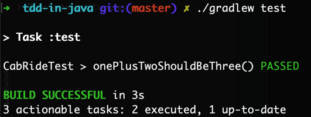
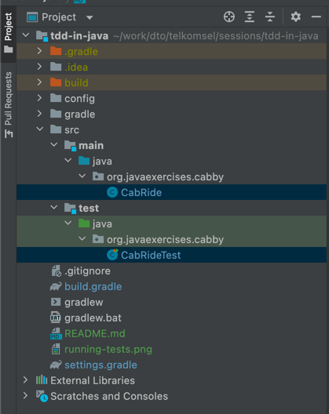

## Prerequisites

- Tested with Java 16 on mac-os. But older Java versions till Java 8 should work
- Gradle 7.1

## Running

Check you have the setup working by running `./gradlew test` in your terminal on mac-os. You should get something like

Then, you can check the appropriate source files and write tests

